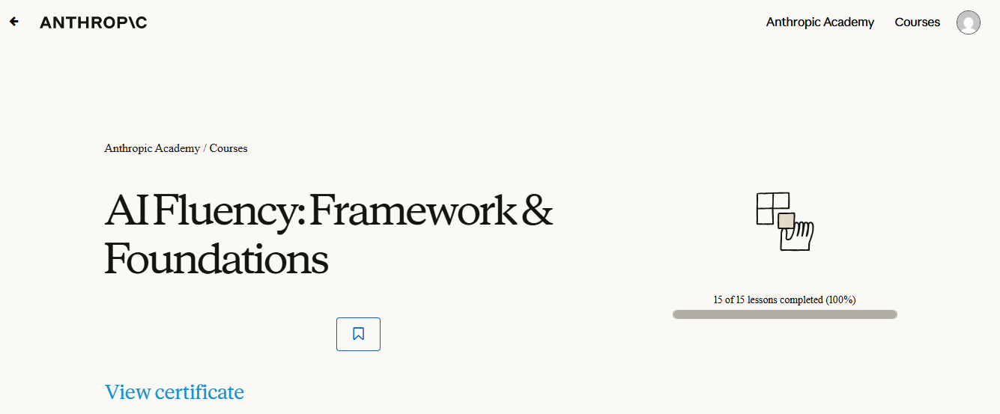
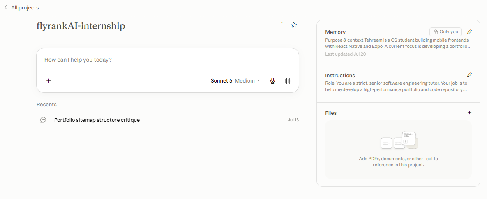

# AI Workflow Audit and Tool Setup

## 1. Workflow Audit 
| Task # | Task Description | Classification | Rationale |
| :--- | :--- | :--- | :--- |
| 1 | Drafting professional emails | **Delegate to AI with review** | AI refines tone and grammar, while I do a quick check before hitting send. |
| 2 | Summarizing long technical articles, documentation or API guides | **Delegate to AI with review** | AI pulls key points from long docs quickly. |
| 3 | Reflecting on personal career goals, learning progress and project ideas | **Just me** | Personal goals and career direction require honest self-reflection that AI cannot do for me. |
| 4 | Brainstorming UI improvements and feature ideas for user experience | **Collaborate with AI** | AI suggests user flow ideas and layout tweaks, while I decide what actually makes sense to build. |
| 5 | Studying theoretical concepts | **Just me** | I need to actually understand core CS concepts myself for exams and academic integrity. 
| 6 | Checking out npm libraries or tools to see if they fit a frontend feature | **Delegate to AI with review** | Good for a quick summary of what a package does, but I still check if it's outdated. |
| 7 | Converting plain JavaScript code into strictly typed TypeScript files | **Collaborate with AI** | Saves time writing boilerplate types, then I fix any bad types or edge cases it missed. |
| 8 | Making dummy JSON data to test lists and component state in my app | **Delegate to AI with review** | AI creates fake user and group data in seconds. I just check the fields and use it. |
| 9 | Fixing state bugs and re-renders in my *Mini Study Group App* (React Native) | **Collaborate with AI** | AI helps me spot broken hooks fast, but I still need to check how the logic fits my screen components. |
| 10 | Writing Firebase Firestore security rules and data models for group chats | **Collaborate with AI** | AI gives me a good starting template for rules, but I have to manually verify user permissions. |

## 2. Tool Setup

## 3. Claude Project Configuration

## 4. Target Tasks & Success Definitions

### 1. Fixing state bugs and re-renders in my *Mini Study Group App* (React Native)
* **Classification:** Collaborate with AI
* **Definition of "Done Well":**
  * Screen renders smoothly with zero infinite re-render loops or crashes.

---

### 2. Writing Firebase Firestore security rules and data models for group chats
* **Classification:** Collaborate with AI
* **Definition of "Done Well":**
  * Collection schemas and document structures are cleanly mapped without unnecessary fields.
  * Security rules strictly restrict read and write access to authenticated group members only.

---

### 3. Making dummy JSON data to test lists and component state in my app
* **Classification:** Delegate to AI with review
* **Definition of "Done Well":**
  * Mock JSON keys precisely match the app's TypeScript interface definitions.
  * Data covers edge cases (e.g., empty arrays, null fields).
