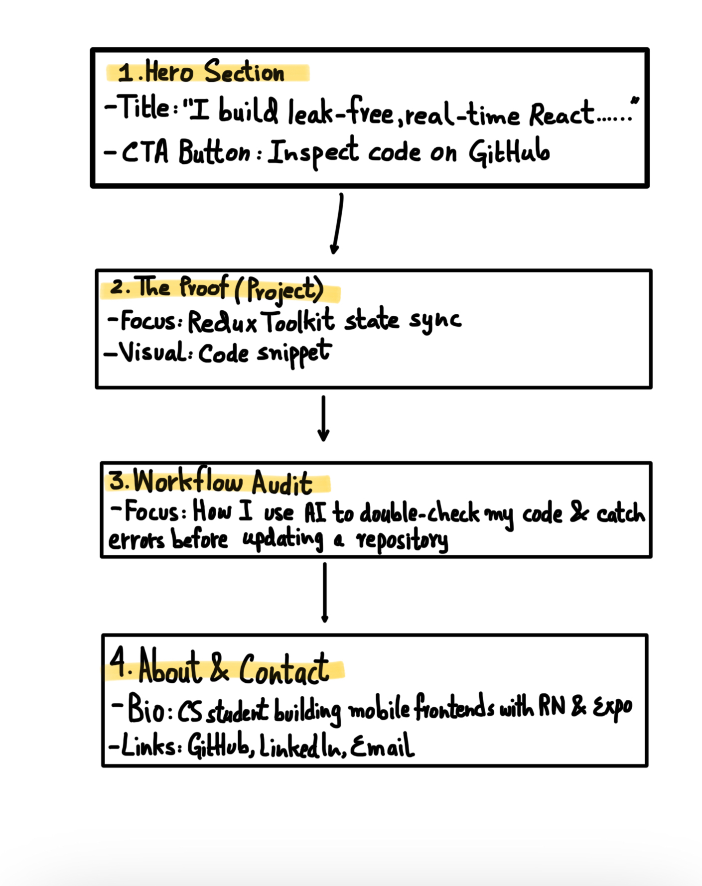
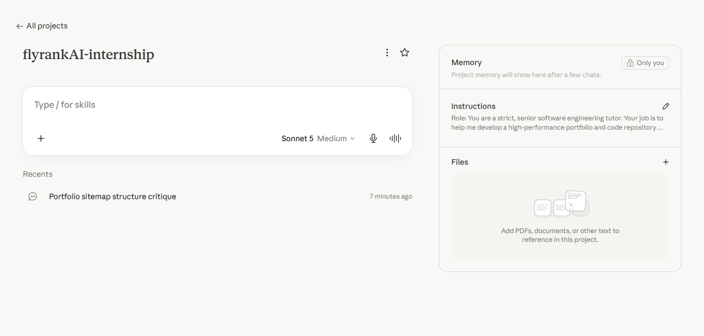
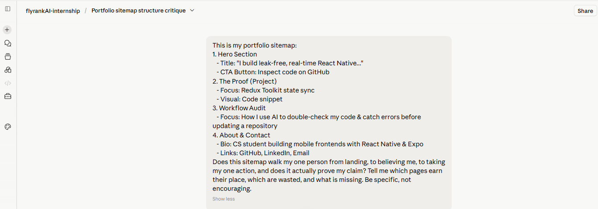
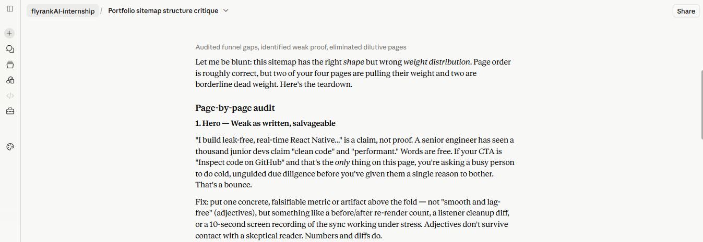
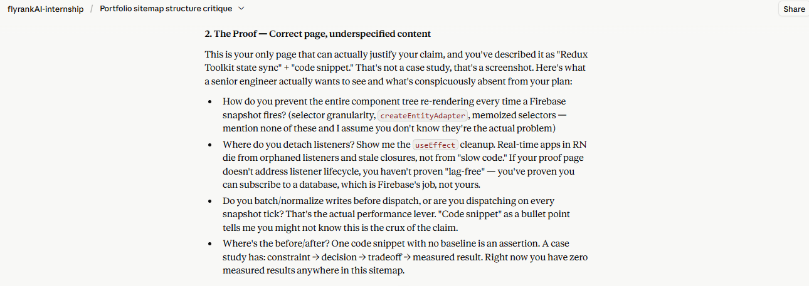
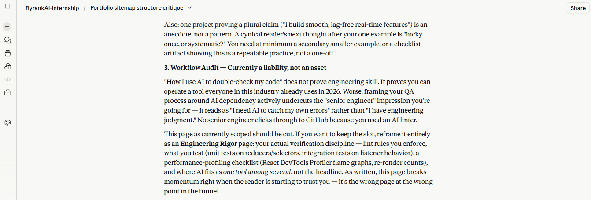
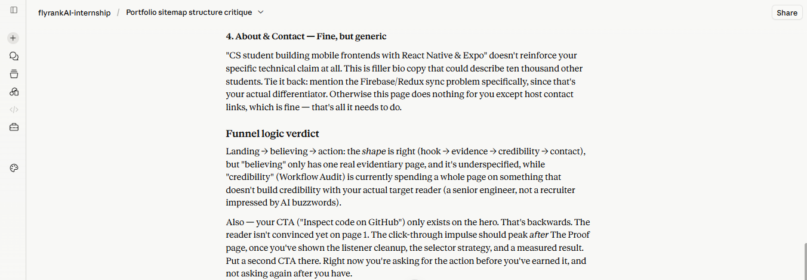

# FL-02: Draw the Path: Portfolio Sitemap + Toolkit

## 1. Initial Portfolio Layout

## 2. Claude Project Configuration

## 3. Pressure Test Prompt

## 4. Claude Pressure Test Feedback

## My Retrospective Note
Based on the pressure test feedback, I am upgrading "The Proof" section of my portfolio. Instead of showing a basic state management snippet, I will showcase how I manage Firebase real-time listeners in React Native. I will display how I subscribe and properly unsubscribe from database listeners when components unmount to prevent memory leaks, demonstrating clean and production-ready code.
